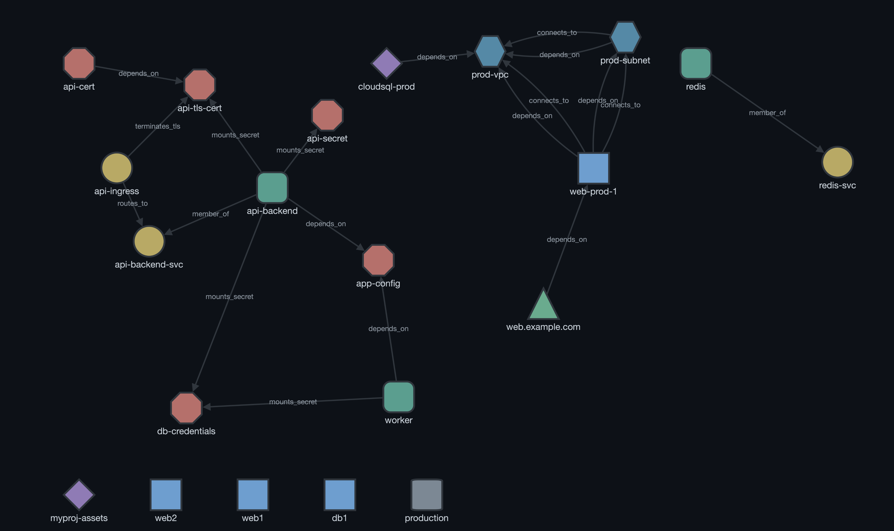

[](https://github.com/matijazezelj/aib/actions/workflows/ci.yml)

# AIB — Assets in a Box



AIB builds a dependency graph from your infrastructure-as-code and stores it in SQLite. From that graph you can inspect blast radius, drift, certificate expiry, and security findings — all from one tool.

Part of the "in a box" toolkit alongside [SIB](https://github.com/matijazezelj/sib) and [NIB](https://github.com/matijazezelj/nib).

## Quick Start

```bash
# Install
git clone https://github.com/matijazezelj/aib.git && cd aib && make build
# or: go install github.com/matijazezelj/aib/cmd/aib@latest
# or: docker compose -f deploy/docker-compose.yml up --build

# Scan & explore
aib scan terraform /path/to/terraform.tfstate
aib scan k8s /path/to/manifests/
aib serve   # http://localhost:8080
```

**Typical workflow:** scan sources → query the graph or open the UI → run `graph audit` → re-scan to track drift.

## GitHub Action

AIB can run in pull requests as a thin wrapper around the CLI: scan IaC, generate Markdown/JSON reports, upload artifacts, and update one stable PR comment.

```yaml
name: AIB Infra Scan

on:
  pull_request:
    paths:
      - "**/*.tfstate"
      - "**/*tfplan*.json"
      - "**/*.yaml"
      - "**/*.yml"
      - "**/docker-compose*.yml"

permissions:
  contents: read
  pull-requests: write

jobs:
  aib:
    runs-on: ubuntu-latest
    steps:
      - uses: actions/checkout@v6
      - uses: matijazezelj/aib@v1.4.0
        with:
          paths: .
          sources: auto
          comment-pr: true
          fail-on: critical
```

Use the release tag that contains the Action. After a moving `v1` major tag is published, `matijazezelj/aib@v1` is also suitable for users who prefer automatic minor updates.

Full action docs: [docs/github-action.md](docs/github-action.md)

## Scanners

AIB ships with seven parsers. Pass multiple paths to any scanner; cross-file references are resolved automatically.

| Scanner | Resource types | Node ID prefix | Key features |
|---------|---------------|----------------|--------------|
| **Terraform state** | 100+ (AWS/GCP/Azure/Cloudflare/TLS) | `tf:` | Attribute edges (`vpc_id`, `subnet_id`, …), security metadata, remote backends |
| **Terraform plan** | Same as state | `tf:` | Pre-deploy impact; actions classified as create/update/delete/replace |
| **Kubernetes / Helm** | Workloads, Services, Ingresses, Secrets, ConfigMaps, Certificates | `k8s:` | Security contexts, selector edges, env-var-based `connects_to` inference, live cluster scanning |
| **Ansible** | Hosts, containers, services | `ansible:` | Inventory-var dependency inference (`db_host`, `redis_host`, `k8s_service`), connection strings |
| **Docker Compose** | Services, networks, volumes | `compose:` | `depends_on`, network membership, volume mounts |
| **CloudFormation** | ~40 (AWS) | `cfn:` | `Ref`, `Fn::GetAtt`, `DependsOn`, property references |
| **Pulumi** | ~80 (AWS/GCP/Azure/K8s/TLS) | `plm:` | Dependency arrays, attribute refs, parent URNs |

```bash
# Examples
aib scan auto .                                      # detect supported IaC files
aib scan terraform *.tfstate                         # multiple state files
aib scan terraform --remote --workspace='*' project/ # remote backends
aib scan k8s manifests/ --helm --values=values.yaml  # Helm chart
aib scan k8s --live --namespace=app                  # live cluster
aib scan ansible inventory.ini --playbooks=./playbooks/
aib scan compose docker-compose.yml
aib scan cloudformation vpc.yaml database.json
aib scan pulumi stack-export.json
```

Full scanner documentation: [docs/scanners.md](docs/scanners.md)

## Graph Queries

```bash
aib graph show                             # summary (counts by type)
aib graph nodes --type=vm --source=terraform
aib graph edges --type=depends_on
aib graph neighbors tf:vm:web-prod-1       # direct neighbors
aib graph path <from-id> <to-id>           # shortest path
aib graph deps <node-id> --depth=10        # dependency chain
aib graph export --format=dot              # also: json, mermaid
aib graph prune --stale-days=30            # remove stale nodes
```

All commands support `-o json` for scripting:

```bash
aib -o json graph nodes --type=vm | jq '.[].id'
aib -o json impact node tf:vm:web-prod-1 | jq '.blast_radius'
```

## Analysis

### Blast Radius

```
$ aib impact node tf:network:prod-vpc

Impact Analysis: tf:network:prod-vpc
   Blast Radius: 4 affected assets

   tf:network:prod-vpc (network)
   ├── [connects_to] tf:subnet:prod-subnet (subnet)
   │   └── [connects_to] tf:vm:web-prod-1 (vm)
   │       └── [depends_on] tf:dns_record:web.example.com (dns_record)
   └── [depends_on] tf:database:cloudsql-prod (database)
```

### Security Audit

Runs 15 checks across three severities:

| Severity | Checks |
|----------|--------|
| **Critical** | Public databases, unencrypted storage, world-open firewall rules, privileged containers, host namespace usage |
| **Warning** | No deletion protection, single-AZ databases, public buckets, public load balancers, public VMs, privilege escalation, root execution, unencrypted ingress |
| **Info** | Orphan secrets, missing container resource limits, absent encryption config |

```bash
aib graph audit
aib -o json graph audit | jq '.findings[] | select(.severity == "critical")'
aib report --format markdown --out aib-report.md
aib report --format json --out aib-report.json
```

The web UI highlights findings on nodes: red border for critical, orange for warning.

### More Analysis

```bash
aib graph cycles                           # circular dependencies
aib graph spof --min-affected=3            # single points of failure
aib graph orphans                          # unconnected nodes
```

### Drift Detection

Every scan automatically diffs against the current database and reports added/removed/modified assets. Drift is source-scoped, so a Terraform scan never flags Kubernetes nodes as removed.

### Certificates

```bash
aib certs probe example.com:443            # probe a TLS endpoint
aib certs list                             # all tracked certs
aib certs expiring --days=30               # expiring within threshold
aib certs check                            # re-probe all known endpoints
```

When running `aib serve`, certificates are probed on a schedule and expiry alerts can be sent to stdout, a webhook, or Slack.

## Web UI & API

```bash
aib serve                                  # default :8080
aib serve --listen=:9090 --read-only       # custom port, no scan triggers
```

**UI features:** source-grouped sidebar with filtering, multiple layout modes, connection-string rendering with copy, connection evidence on edges, security risk indicators, focus modes (dependencies / impact / secrets path / external path), optional online icons via [Simple Icons](https://simpleicons.org/).

**API docs** at `/api/docs` (Swagger UI). Full endpoint reference: [docs/api.md](docs/api.md)

### Authentication

```yaml
server:
  api_token: "${AIB_API_TOKEN}"
```

Auth applies to `/api/*` routes only. Includes CSP headers, rate limiting (10 req/s), body limits (1 MB), path traversal checks, and scan path allowlisting.

## Configuration

Defaults work out of the box. Create `aib.yaml` in the working directory or `~/.aib/` to customize:

```yaml
storage:
  path: "./data/aib.db"
  memgraph:
    enabled: false
    uri: "bolt://localhost:7687"

server:
  listen: ":8080"
  api_token: "${AIB_API_TOKEN}"

scan:
  schedule: "4h"
  allowed_paths: ["/opt/infra"]

certs:
  probe_interval: "6h"
  alert_thresholds: [90, 60, 30, 14, 7, 1]

alerts:
  stdout: { enabled: true }
  webhook: { enabled: false, url: "http://sib:8080/api/v1/events" }
  slack: { enabled: false, webhook_url: "https://hooks.slack.com/..." }
```

All values support `${ENV_VAR}` expansion and `AIB_`-prefixed env overrides (e.g. `AIB_SERVER_LISTEN`).

Full reference: [docs/configuration.md](docs/configuration.md) and [`configs/aib.yaml.example`](configs/aib.yaml.example).

### Memgraph (Optional)

SQLite is the source of truth. Optionally add [Memgraph](https://github.com/memgraph/memgraph) for faster graph traversals at scale. AIB falls back to its built-in BFS engine when Memgraph is unavailable.

```bash
docker run -p 7687:7687 memgraph/memgraph-mage
# Enable: storage.memgraph.enabled: true
aib graph sync   # sync existing data
```

## How AIB Compares

| Tool | Approach | Data Source | Graph DB | Drift | Blast Radius | Cert Tracking | Security Audit |
|------|----------|-------------|----------|-------|--------------|---------------|----------------|
| **AIB** | Parse IaC files locally | Terraform, K8s, Ansible, Compose, CFn, Pulumi | SQLite + optional Memgraph | Yes | Yes | Yes | Yes |
| [Cartography](https://github.com/lyft/cartography) | Live API discovery | AWS, GCP, Azure, GitHub, … | Neo4j (required) | No | No | No | Limited |
| [CloudQuery](https://github.com/cloudquery/cloudquery) | Sync cloud APIs to SQL | 100+ cloud providers | PostgreSQL | No | No | No | Via policies |
| [Steampipe](https://github.com/turbot/steampipe) | SQL over live APIs | 140+ plugins | Embedded Postgres | No | No | No | Via mods |
| [inframap](https://github.com/cycloidio/inframap) | Visualise TF state | Terraform only | None (DOT output) | No | No | No | No |
| [Rover](https://github.com/im2nguyen/rover) | Visualise TF state/plan | Terraform only | None (browser UI) | No | No | No | No |
| `terraform graph` | Built-in TF command | Terraform only | None (DOT output) | No | No | No | No |
| [Backstage](https://github.com/backstage/backstage) | Service catalog | Manual YAML + plugins | PostgreSQL | No | No | No | Via plugins |

**Key differences:**

- **No cloud credentials required** — AIB parses IaC files that already exist in your repo; it never calls cloud APIs.
- **Multi-source in one graph** — Terraform, Kubernetes, Ansible, Compose, CloudFormation, and Pulumi assets land in a single unified graph, enabling cross-stack blast-radius analysis.
- **All-in-one binary** — drift detection, TLS certificate tracking, security audit (15 checks), SPOF/cycle/orphan analysis, and a web UI ship in a single ~15 MB binary with zero external dependencies (SQLite is embedded).
- **Cartography / CloudQuery / Steampipe** excel at live cloud inventory but require API credentials, a running database, and don't parse IaC.
- **inframap / Rover / `terraform graph`** visualise Terraform only and don't analyse blast radius, drift, or security posture.

## Known Limitations

- **Single-instance** — no clustering; suitable for up to ~10K assets
- **No built-in TLS** — use a reverse proxy for HTTPS
- **Single API token** — no per-user RBAC
- **Partial parser coverage** — not all provider resource types are mapped
- **Internal networks only** — do not expose directly to the internet

## Development

```bash
make build       # Build binary
make test        # Run tests
make fmt         # Format code
make lint        # Run linter
make clean       # Remove build artifacts
```

## License

Apache 2.0
